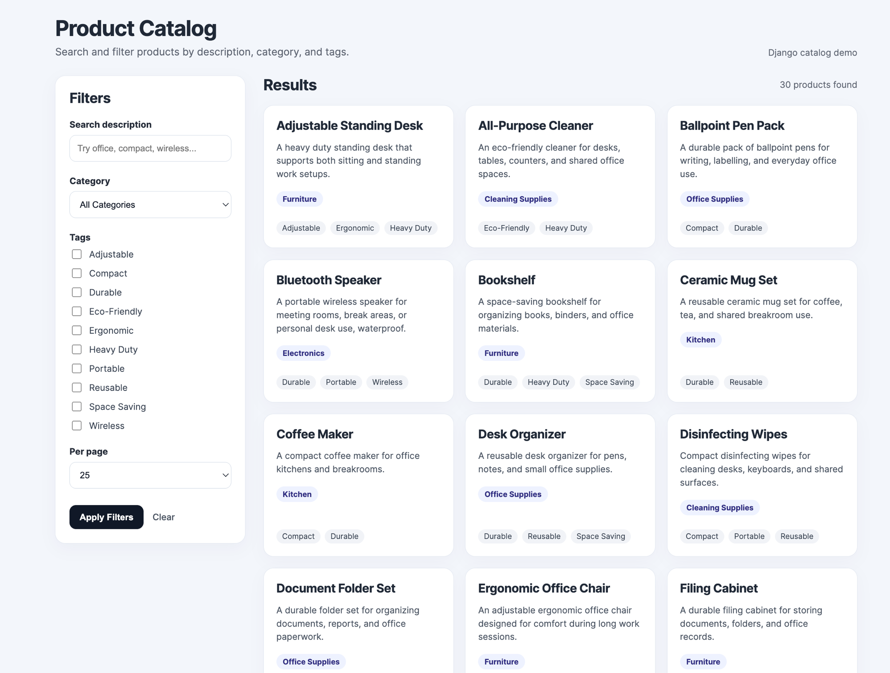
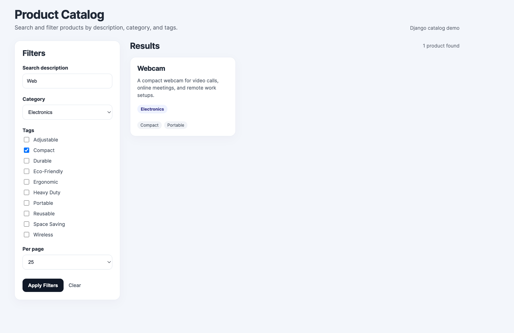
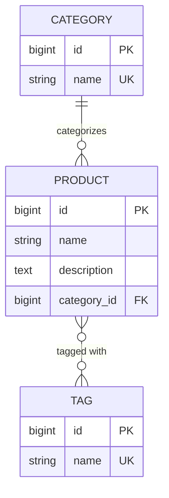
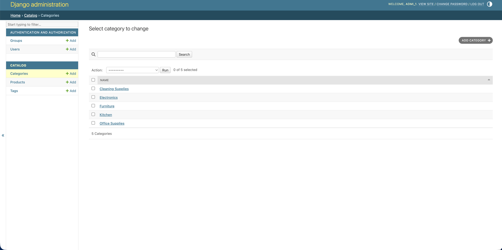
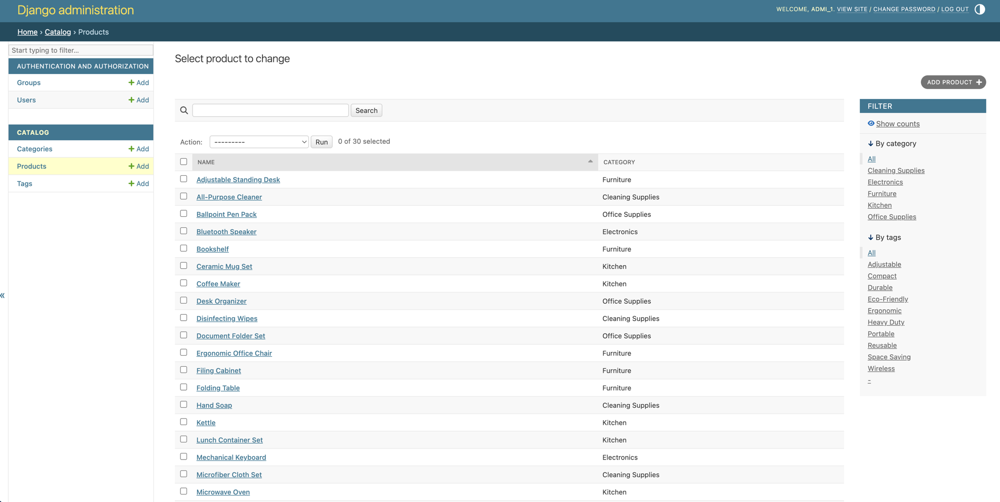
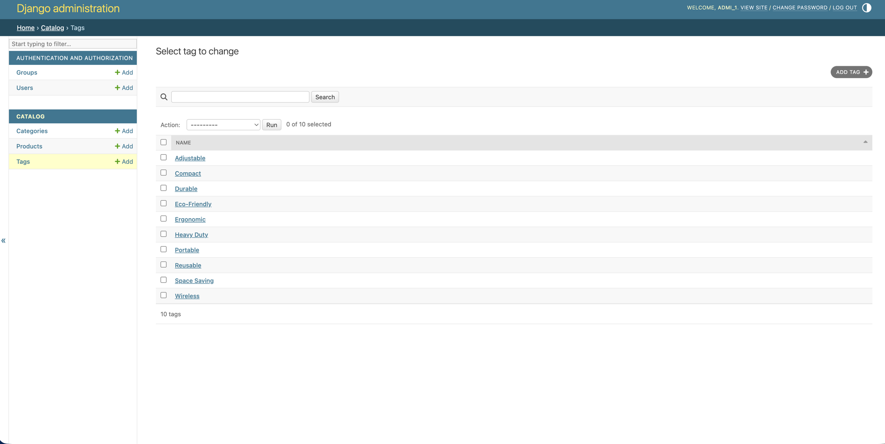

# Product Catalog

A small Django project that models **products**, **categories**, and **tags**, and
serves a single page where you can search products by description and filter them
by category and tags. Search and filters can be combined.



## Requirements

- **Python 3.12+** (required by Django 6.0)
- Django 6.0.6 (installed via `requirements.txt`)
- SQLite — bundled with Python, no database server to install

## Setup and run

```bash
# 1. Clone and enter the project
git clone https://github.com/a199929abc/django-product-catalog.git
cd django-product-catalog

# 2. Create and activate a virtual environment
python3 -m venv venv
source venv/bin/activate          # Windows: venv\Scripts\activate

# 3. Install dependencies
pip install -r requirements.txt

# 4. Create the database schema
python manage.py migrate

# 5. Load the sample data (5 categories, 10 tags, 30 products)
python manage.py loaddata sample_data

# 6. (Optional) Create an admin account to browse/edit data in the admin
python manage.py createsuperuser

# 7. Run the development server
python manage.py runserver
```

Then open:

- Catalog page: [http://127.0.0.1:8000/](http://127.0.0.1:8000/)
- Admin: [http://127.0.0.1:8000/admin/](http://127.0.0.1:8000/admin/)

> The `db.sqlite3` file is intentionally gitignored, so a fresh clone starts with
> an empty database. Step 4 (`migrate`) creates the schema and step 5
> (`loaddata`) populates the sample data — don't skip them or the catalog page
> will be empty.

## Features

The catalog page (`/`) lets a user:

- **Search by description** — case-insensitive substring match.
- **Filter by category** — single category dropdown.
- **Filter by tags** — multi-select checkboxes; a product matches if it has _any_
  of the selected tags.
- **Combine** search + category + tags in one request.
- **Paginate** results, with a selectable page size (25 / 50 / 100, default 25).
  The active search and filters are preserved as you page through results.

Example below: searching `Web`, category `Electronics`, and tag `Compact`
together narrow 30 products down to one.



## Data model



- **Category → Product**: one-to-many (`Product.category`, FK). Each product
  belongs to exactly one category.
- **Product and Tag**: many-to-many (`Product.tags`). A product can have zero or
  more tags, and a tag can apply to many products.

The query logic lives in `catalog/views.py`. It uses `select_related("category")`
and `prefetch_related("tags")` to avoid N+1 queries, and `.distinct()` on the
tag filter so a product isn't repeated when it matches multiple selected tags.

## Data population

The sample data was entered through the **Django admin** interface. The admin is
registered for all three models in `catalog/admin.py` (with list display, search,
and filters), so you can add or edit records yourself after creating a superuser.

For one-command reproducibility, the same dataset is also exported as a fixture at
`catalog/fixtures/sample_data.json` and loaded in step 5 above.

| Categories (5)                                                | Products (30)                                             | Tags (10)                                         |
| ------------------------------------------------------------- | --------------------------------------------------------- | ------------------------------------------------- |
|  |  |  |

## Running the tests

```bash
python manage.py test
```

The suite (`catalog/tests.py`) covers search, each filter, combined filtering,
pagination (default size, page-size options, out-of-range pages), URL routing,
and graceful handling of invalid query parameters.

## Configuration notes

The app runs on Django's local-development defaults (`DEBUG=True`, SQLite), which
are all that's needed to run and review this take-home; production hardening is out
of scope. `SECRET_KEY` falls back to a bundled dev key and can optionally be
overridden with the `DJANGO_SECRET_KEY` environment variable.

## Production considerations

The catalog runs on local defaults; for a production deployment the areas I'd focus
on:

- **Server-authoritative state.** Filtering, pagination, and all writes stay on the
  server; the database is the source of truth and the page only fetches and renders.
  Every create/update is validated and persisted server-side. (Already true here —
  filtering and pagination are server-side.)
- **AuthN / AuthZ.** Keep public browsing read-only and restrict catalog edits to
  authenticated staff, building on Django's auth and permission framework — e.g.,
  roles such as _catalog editor_ vs. _viewer_ governing who can view, create, edit,
  and delete products.
- **Audit trail.** Record who changed which records and when (Django admin's
  `LogEntry`, or `django-simple-history` for full row history), plus `created_by` /
  `updated_by` and timestamps.
- **CI/CD pipeline.** Run the test / lint (and type-check, once type hints are added)
  gate automatically on every PR, and ship deploys — including DB migrations —
  through the pipeline rather than by hand.
- **Config & serving.** `DEBUG=False`, a real `ALLOWED_HOSTS`, and all secrets from
  the environment.
- **Containerization & scaling.** Package the app in a container and run several
  stateless instances behind a load balancer. Because state lives in the database
  rather than the process, the app scales horizontally.

## Assumptions and notes

- **Search targets the product description** (case-insensitive substring), as
  specified in the brief. Product names are not searched.
- **Tag filtering uses OR semantics** — selecting multiple tags returns products
  that have _any_ of them. (AND semantics, requiring all selected tags, would be a
  one-line change if preferred.)
- **The catalog is served at `/`.** The earlier `/products/` URL still works and
  redirects to `/`.
- **SQLite** is used for simplicity; nothing in the app is SQLite-specific.

## AI usage

In line with the assignment's AI policy, this section documents how AI tools
(Claude) were used. I have read and conduct **codereview** in the submission and can
explain it.

- **Data model** (`catalog/models.py`): I designed and implemented the models and
  their relationships myself.
- **Tests** (`catalog/tests.py`): a collaboration. I reviewed the suite to find
  uncovered cases and to check that each test's logic was sound; AI assisted with
  implementing the test code.
- **README and the data-model diagram**: AI produced an initial draft and structure
  and generated the Mermaid ER diagram from my models; I then reviewed and filled in
  the project-specific details.
- **HTML template** (`catalog/templates/catalog/product_list.html`): AI-assisted to
  speed up development; I reviewed and fine-tuned the markup and styling.
- **Search and filtering** (`catalog/views.py`): I implemented the search/filter view
  and its querysets myself, including the OR-semantics tag filter with `.distinct()`
  and the `select_related` / `prefetch_related` query optimization.
- **Pagination** (`catalog/views.py`): my idea and design — I specified the behavior
  and the cases (selectable page sizes via a whitelist, out-of-range/invalid page
  handling, and preserving filters across page links); AI assisted with the
  implementation, which I code reviewed and can explain.
